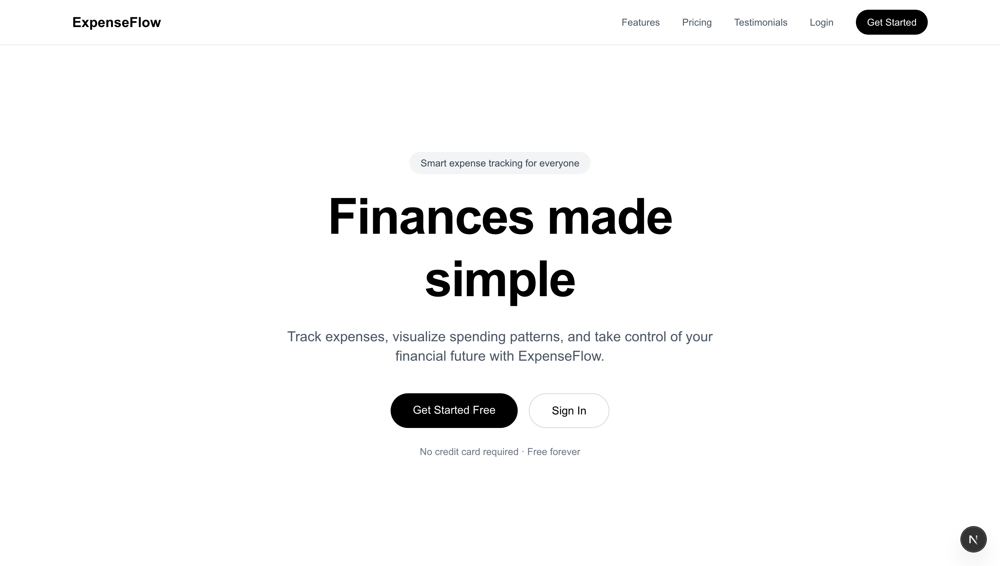
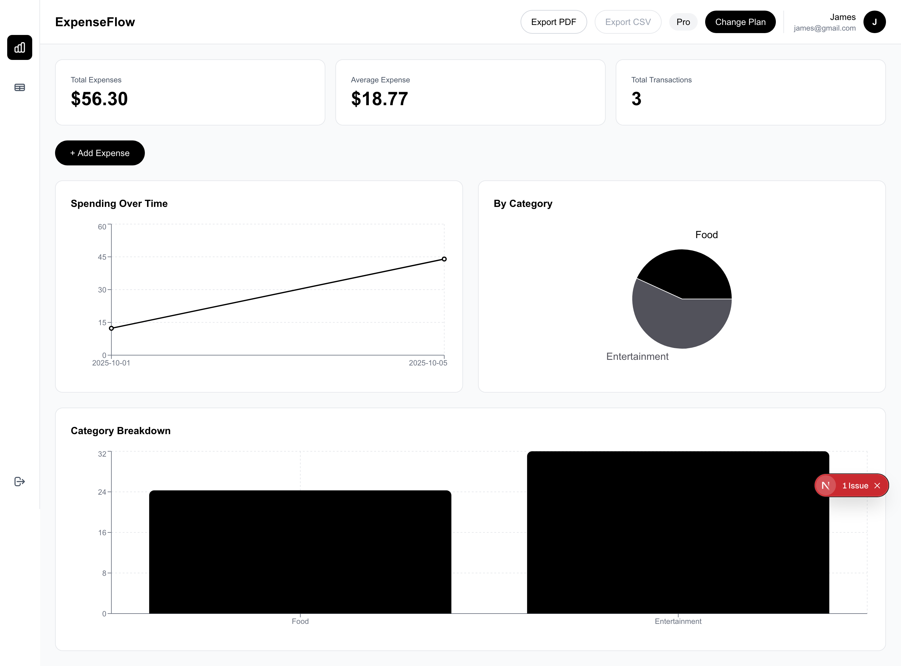
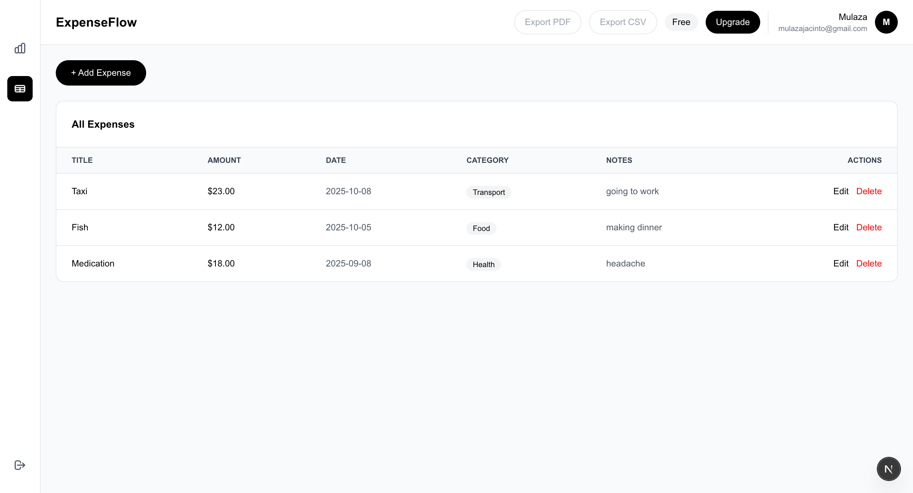
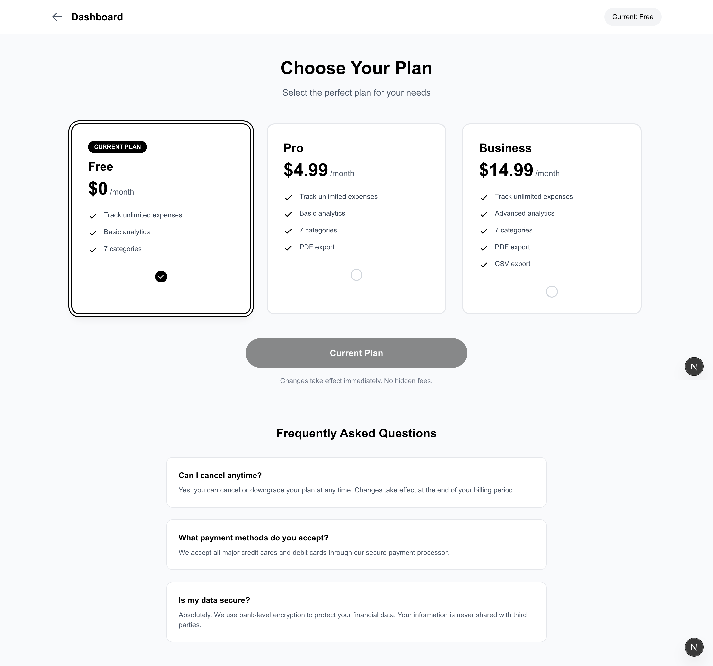
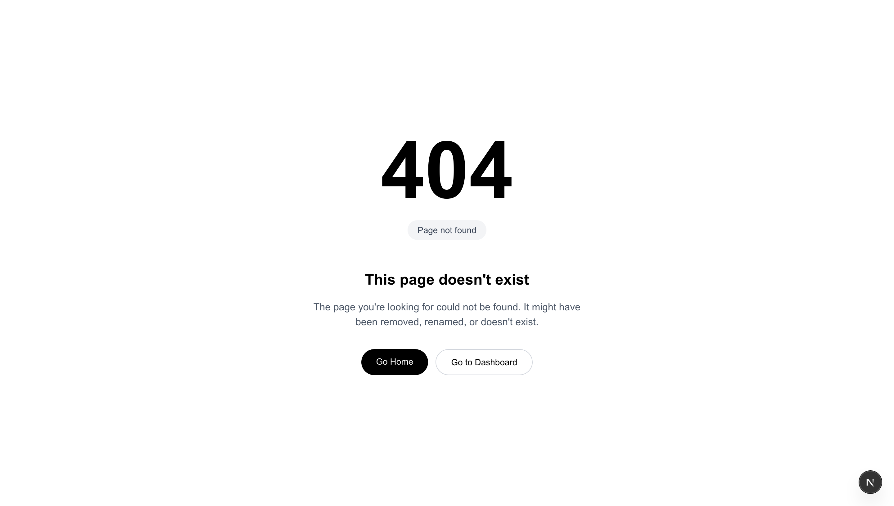

<p align="center">
  <br>
  
  <h1 align="center">ExpenseFlow</h1>
</p>

ExpenseFlow is a minimalist expense tracking application built with Next.js and Supabase. Track your expenses, visualize spending patterns, and export your financial data with ease.


## Task Requirements

Read the requirements for the take home task [here](./public/readme-files/requirements.md).

---

## Screenshots










---

## Features

- **User Authentication** - Secure signup/login with email
- **Expense Management** - Add, edit, and delete expenses with categories
- **Visual Analytics** - Interactive charts showing spending patterns
- **Multi-tier Plans** - Free, Pro, and Business subscription tiers
- **PDF Export** - Generate professional PDF reports (Pro & Business)
- **CSV Export** - Download expense data as CSV (Business only)
---

## Tech Stack

- **Framework:** Next.js 14+ (App Router)
- **Database:** Supabase (PostgreSQL)
- **Authentication:** Supabase Auth
- **Styling:** Tailwind CSS
- **Charts:** Recharts
- **PDF Generation:** jsPDF + jspdf-autotable
- **Language:** TypeScript

---

## Prerequisites

Before you begin, ensure you have the following installed:

- **Node.js** (v18.0.0 or higher)
- **npm** or **yarn**
- **Git**
- A **Supabase** account ([Sign up here](https://supabase.com))

---

## Installation

### 1. Clone the Repository

```bash
git clone https://github.com/yourusername/expenseflow.git
cd expenseflow
```

### 2. Install Dependencies

```bash
npm install
# or
yarn install

```

### 3. Set Up Environment Variables

Create a `.env.local` file in the root directory:

```bash
touch .env.local
```

Add the following environment variables:

```env
# Supabase Configuration
NEXT_PUBLIC_SUPABASE_URL=your_supabase_project_url
NEXT_PUBLIC_SUPABASE_ANON_KEY=your_supabase_anon_key
SUPABASE_SERVICE_ROLE_KEY=your_supabase_service_role_key
```

**How to get these values:**

1. Go to your [Supabase Dashboard](https://app.supabase.com)
2. Select your project (or create a new one)
3. Navigate to **Settings** → **API**
4. Copy the following:
   - **Project URL** → `NEXT_PUBLIC_SUPABASE_URL`
   - **anon public** key → `NEXT_PUBLIC_SUPABASE_ANON_KEY`
   - **service_role** key → `SUPABASE_SERVICE_ROLE_KEY`

---

## Database Setup

### 1. Create Tables

Run the following SQL in your Supabase SQL Editor:

Learn more about the [Database Schema Design](./public/readme-files/schema.md)

```sql
-- ExpenseFlow Database Schema 

-- 1. Create subscription_plans table
CREATE TABLE subscription_plans (
  id UUID DEFAULT gen_random_uuid() PRIMARY KEY,
  name TEXT UNIQUE NOT NULL,
  display_name TEXT NOT NULL,
  price NUMERIC(10, 2) NOT NULL DEFAULT 0.00,
  features JSONB NOT NULL DEFAULT '[]'::jsonb,
  can_export_pdf BOOLEAN NOT NULL DEFAULT false,
  can_export_csv BOOLEAN NOT NULL DEFAULT false,
  created_at TIMESTAMP WITH TIME ZONE DEFAULT TIMEZONE('utc'::text, NOW()) NOT NULL,
  updated_at TIMESTAMP WITH TIME ZONE DEFAULT TIMEZONE('utc'::text, NOW()) NOT NULL
);

-- Insert default subscription plans
INSERT INTO subscription_plans (name, display_name, price, features, can_export_pdf, can_export_csv) VALUES
  ('free', 'Free', 0.00, 
   '["Track unlimited expenses", "Basic analytics", "7 categories"]'::jsonb,
   false, false),
  ('pro', 'Pro', 4.99,
   '["Track unlimited expenses", "Basic analytics", "7 categories", "PDF export"]'::jsonb,
   true, false),
  ('business', 'Business', 14.99,
   '["Track unlimited expenses", "Advanced analytics", "7 categories", "PDF export", "CSV export"]'::jsonb,
   true, true);

-- 2. Create user_subscriptions table
CREATE TABLE user_subscriptions (
  id UUID DEFAULT gen_random_uuid() PRIMARY KEY,
  user_id UUID NOT NULL,
  plan_id UUID REFERENCES subscription_plans(id) ON DELETE RESTRICT NOT NULL,
  created_at TIMESTAMP WITH TIME ZONE DEFAULT TIMEZONE('utc'::text, NOW()) NOT NULL,
  updated_at TIMESTAMP WITH TIME ZONE DEFAULT TIMEZONE('utc'::text, NOW()) NOT NULL,
  UNIQUE(user_id)
);

-- Add indexes
CREATE INDEX idx_user_subscriptions_user_id ON user_subscriptions(user_id);
CREATE INDEX idx_user_subscriptions_plan_id ON user_subscriptions(plan_id);

-- 3. Create expenses table
CREATE TABLE expenses (
  id UUID DEFAULT gen_random_uuid() PRIMARY KEY,
  user_id UUID NOT NULL,
  title TEXT NOT NULL,
  amount NUMERIC(10, 2) NOT NULL,
  date DATE NOT NULL,
  category TEXT NOT NULL,
  notes TEXT,
  created_at TIMESTAMP WITH TIME ZONE DEFAULT TIMEZONE('utc'::text, NOW()) NOT NULL,
  updated_at TIMESTAMP WITH TIME ZONE DEFAULT TIMEZONE('utc'::text, NOW()) NOT NULL
);

-- Add indexes
CREATE INDEX idx_expenses_user_id ON expenses(user_id);
CREATE INDEX idx_expenses_date ON expenses(date);
CREATE INDEX idx_expenses_category ON expenses(category);

-- 4. Enable RLS
ALTER TABLE subscription_plans ENABLE ROW LEVEL SECURITY;
ALTER TABLE user_subscriptions ENABLE ROW LEVEL SECURITY;
ALTER TABLE expenses ENABLE ROW LEVEL SECURITY;

-- 5. RLS Policies for subscription_plans (anyone can view)
CREATE POLICY "Anyone can view subscription plans"
  ON subscription_plans FOR SELECT
  USING (true);

-- 6. RLS Policies for user_subscriptions
-- Allow service_role full access
CREATE POLICY "Service role has full access to subscriptions"
  ON user_subscriptions FOR ALL
  TO service_role
  USING (true)
  WITH CHECK (true);

-- Allow authenticated users to view their own
CREATE POLICY "Users can view their own subscription"
  ON user_subscriptions FOR SELECT
  TO authenticated
  USING (auth.uid()::text = user_id::text);

-- Allow authenticated users to update their own
CREATE POLICY "Users can update their own subscription"
  ON user_subscriptions FOR UPDATE
  TO authenticated
  USING (auth.uid()::text = user_id::text)
  WITH CHECK (auth.uid()::text = user_id::text);

-- 7. RLS Policies for expenses
-- Allow service_role full access
CREATE POLICY "Service role has full access to expenses"
  ON expenses FOR ALL
  TO service_role
  USING (true)
  WITH CHECK (true);

-- Allow authenticated users full access to their own
CREATE POLICY "Users can view their own expenses"
  ON expenses FOR SELECT
  TO authenticated
  USING (auth.uid()::text = user_id::text);

CREATE POLICY "Users can insert their own expenses"
  ON expenses FOR INSERT
  TO authenticated
  WITH CHECK (auth.uid()::text = user_id::text);

CREATE POLICY "Users can update their own expenses"
  ON expenses FOR UPDATE
  TO authenticated
  USING (auth.uid()::text = user_id::text)
  WITH CHECK (auth.uid()::text = user_id::text);

CREATE POLICY "Users can delete their own expenses"
  ON expenses FOR DELETE
  TO authenticated
  USING (auth.uid()::text = user_id::text);

-- 8. Create updated_at trigger function
CREATE OR REPLACE FUNCTION update_updated_at_column()
RETURNS TRIGGER AS $$
BEGIN
  NEW.updated_at = TIMEZONE('utc'::text, NOW());
  RETURN NEW;
END;
$$ LANGUAGE plpgsql;

-- 9. Add updated_at triggers
CREATE TRIGGER update_subscription_plans_updated_at
  BEFORE UPDATE ON subscription_plans
  FOR EACH ROW 
  EXECUTE FUNCTION update_updated_at_column();

CREATE TRIGGER update_user_subscriptions_updated_at
  BEFORE UPDATE ON user_subscriptions
  FOR EACH ROW 
  EXECUTE FUNCTION update_updated_at_column();

CREATE TRIGGER update_expenses_updated_at
  BEFORE UPDATE ON expenses
  FOR EACH ROW 
  EXECUTE FUNCTION update_updated_at_column();

-- 10. Create helpful view
CREATE VIEW user_subscription_details AS
SELECT 
  us.id,
  us.user_id,
  sp.id as plan_id,
  sp.name as plan_name,
  sp.display_name,
  sp.price,
  sp.features,
  sp.can_export_pdf,
  sp.can_export_csv,
  us.created_at as subscribed_at,
  us.updated_at as last_updated
FROM user_subscriptions us
JOIN subscription_plans sp ON us.plan_id = sp.id;

-- 11. Grant necessary permissions
GRANT ALL ON subscription_plans TO service_role;
GRANT ALL ON user_subscriptions TO service_role;
GRANT ALL ON expenses TO service_role;
GRANT SELECT ON subscription_plans TO authenticated;
GRANT SELECT ON user_subscription_details TO authenticated, anon;

-- 12. Verify setup
DO $$
DECLARE
  plan_count INTEGER;
BEGIN
  SELECT COUNT(*) INTO plan_count FROM subscription_plans;
  RAISE NOTICE 'Setup complete! Found % subscription plans', plan_count;
END $$;
```

### 2. Set Up Authentication

1. In Supabase Dashboard, go to **Authentication** → **Providers**
2. Enable **Email** provider (enabled by default)
3. (Optional) Enable **Github** OAuth:
   - Follow the [Supabase GitHub OAuth guide](https://supabase.com/docs/guides/auth/social-login/auth-github).  
   - Go to [GitHub Developer Settings → OAuth Apps](https://github.com/settings/developers).  
   - Click **“New OAuth App”** and fill in the details:  
     - **Application Name:** your app name (e.g., *ExpenseFlow*)  
     - **Homepage URL:** your app URL (or `http://localhost:3000` for local development or your own local host port)  
     - **Authorization Callback URL:**  
       ```
       https://<your-supabase-project-ref>.supabase.co/auth/v1/callback
       ```
   - After creating the app, copy the **Client ID** and **Client Secret** from GitHub.  
   - In Supabase, go to **Authentication → Providers → GitHub** and paste the **Client ID** and **Client Secret** into the respective fields.  
4. Save changes.  

### 3. Configure Redirect URLs

In **Authentication** → **URL Configuration**, add:

```
Site URL: http://localhost:3000 (or your own local host port)
```

---

## Running the Application

### Development Mode

```bash
npm run dev
# or
yarn dev
```

Open [http://localhost:3000](http://localhost:3000) in your browser.

### Production Build

```bash
npm run build
npm start
# or
yarn run build
yarn start
```

---

## Usage

### Creating an Account

1. Navigate to `/signup`
2. Enter your name, email, and password
3. Agree to Terms of Service
4. Click "Create Account"

### Adding Expenses

1. Log in to your dashboard
2. Click "+ Add Expense"
3. Fill in the details (title, amount, date, category, notes)
4. Click "Add Expense"

### Viewing Analytics

- Switch between **Charts View** and **Table View** using the sidebar icons
- Charts View shows:
  - Total expenses summary
  - Spending over time (line chart)
  - Category breakdown (pie chart)
  - Bar chart comparison

### Exporting Data

**PDF Export** (Pro & Business plans):
- Click "Export PDF" in the header
- A professional PDF report will download

**CSV Export** (Business plan only):
- Click "Export CSV" in the header
- A CSV file with all expense data will download

### Upgrading Plans

1. Click "Upgrade" or "Change Plan" in the header
2. Select your desired plan (Free, Pro, Business)
3. Click "Upgrade Now"
---

<p align="center">
  <br>
  <p align="center">Made by Mulaza Jacinto</p>
</p>
