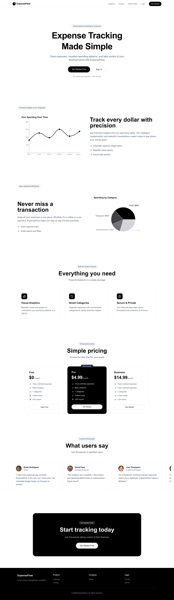
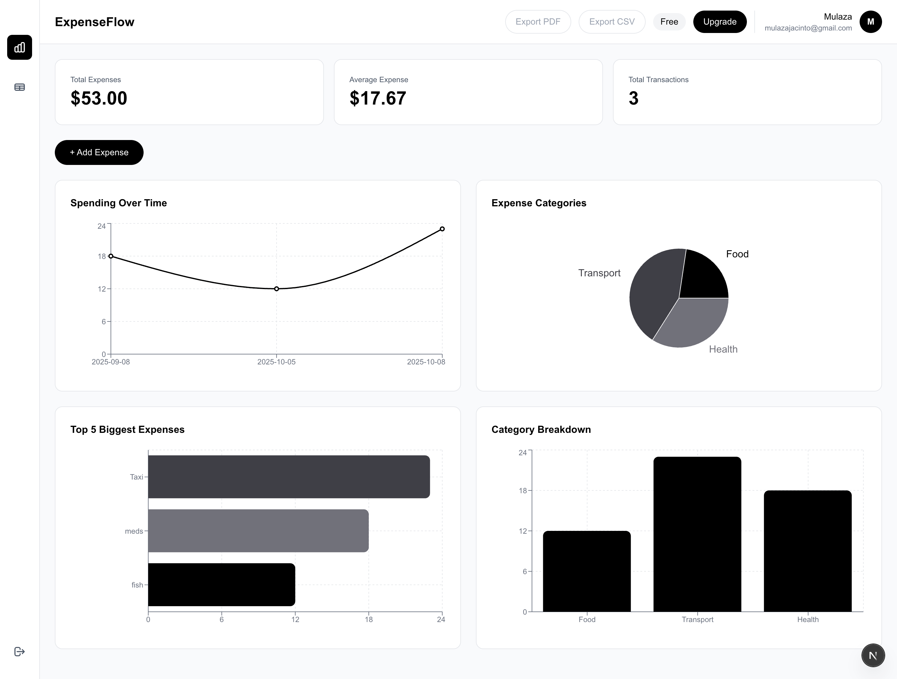

<h1 align="center">ExpenseFlow</h1>

<p align="center">
  <br>
  
  <br>  <br> 
</p>

A modern, minimalist expense tracking application built with Next.js and Supabase. Track your expenses, visualize spending patterns, and export your financial data with ease.

## Screenshots






---

## Features

- **User Authentication** - Secure signup/login with email and Google OAuth
- **Expense Management** - Add, edit, and delete expenses with categories
- **Visual Analytics** - Interactive charts showing spending patterns
- **Multi-tier Plans** - Free, Pro, and Business subscription tiers
- **PDF Export** - Generate professional PDF reports (Pro & Business)
- **CSV Export** - Download expense data as CSV (Business only)
- **Responsive Design** - Beautiful UI that works on all devices
- **Real-time Updates** - Instant data synchronization with Supabase

---

## Tech Stack

- **Framework:** Next.js 14+ (App Router)
- **Database:** Supabase (PostgreSQL)
- **Authentication:** Supabase Auth
- **Styling:** Tailwind CSS
- **Charts:** Recharts
- **PDF Generation:** jsPDF + jspdf-autotable
- **Language:** TypeScript

---

## Prerequisites

Before you begin, ensure you have the following installed:

- **Node.js** (v18.0.0 or higher)
- **npm** or **yarn** or **pnpm**
- **Git**
- A **Supabase** account ([Sign up here](https://supabase.com))

---

## Installation

### 1. Clone the Repository

```bash
git clone https://github.com/yourusername/expenseflow.git
cd expenseflow
```

### 2. Install Dependencies

```bash
npm install
# or
yarn install
# or
pnpm install
```

### 3. Set Up Environment Variables

Create a `.env.local` file in the root directory:

```bash
touch .env.local
```

Add the following environment variables:

```env
# Supabase Configuration
NEXT_PUBLIC_SUPABASE_URL=your_supabase_project_url
NEXT_PUBLIC_SUPABASE_ANON_KEY=your_supabase_anon_key
SUPABASE_SERVICE_ROLE_KEY=your_supabase_service_role_key
```

**How to get these values:**

1. Go to your [Supabase Dashboard](https://app.supabase.com)
2. Select your project (or create a new one)
3. Navigate to **Settings** → **API**
4. Copy the following:
   - **Project URL** → `NEXT_PUBLIC_SUPABASE_URL`
   - **anon public** key → `NEXT_PUBLIC_SUPABASE_ANON_KEY`
   - **service_role** key → `SUPABASE_SERVICE_ROLE_KEY`

---

## Database Setup

### 1. Create Tables

Run the following SQL in your Supabase SQL Editor:

```sql
-- Enable UUID extension
CREATE EXTENSION IF NOT EXISTS "uuid-ossp";

-- Create expenses table
CREATE TABLE IF NOT EXISTS expenses (
  id UUID PRIMARY KEY DEFAULT uuid_generate_v4(),
  user_id UUID NOT NULL REFERENCES auth.users(id) ON DELETE CASCADE,
  title TEXT NOT NULL,
  amount DECIMAL(10, 2) NOT NULL,
  date DATE NOT NULL,
  category TEXT NOT NULL,
  notes TEXT,
  created_at TIMESTAMP WITH TIME ZONE DEFAULT NOW(),
  updated_at TIMESTAMP WITH TIME ZONE DEFAULT NOW()
);

-- Create user_subscriptions table
CREATE TABLE IF NOT EXISTS user_subscriptions (
  id UUID PRIMARY KEY DEFAULT uuid_generate_v4(),
  user_id UUID NOT NULL REFERENCES auth.users(id) ON DELETE CASCADE UNIQUE,
  plan TEXT NOT NULL DEFAULT 'free' CHECK (plan IN ('free', 'pro', 'business')),
  created_at TIMESTAMP WITH TIME ZONE DEFAULT NOW(),
  updated_at TIMESTAMP WITH TIME ZONE DEFAULT NOW()
);

-- Enable Row Level Security
ALTER TABLE expenses ENABLE ROW LEVEL SECURITY;
ALTER TABLE user_subscriptions ENABLE ROW LEVEL SECURITY;

-- Policies for expenses (user can only access their own)
CREATE POLICY "Users can view their own expenses"
  ON expenses FOR SELECT
  USING (auth.uid() = user_id);

CREATE POLICY "Users can insert their own expenses"
  ON expenses FOR INSERT
  WITH CHECK (auth.uid() = user_id);

CREATE POLICY "Users can update their own expenses"
  ON expenses FOR UPDATE
  USING (auth.uid() = user_id);

CREATE POLICY "Users can delete their own expenses"
  ON expenses FOR DELETE
  USING (auth.uid() = user_id);

-- Policies for user_subscriptions
CREATE POLICY "Users can view their own subscription"
  ON user_subscriptions FOR SELECT
  USING (auth.uid() = user_id);

CREATE POLICY "Users can insert their own subscription"
  ON user_subscriptions FOR INSERT
  WITH CHECK (auth.uid() = user_id);

CREATE POLICY "Users can update their own subscription"
  ON user_subscriptions FOR UPDATE
  USING (auth.uid() = user_id);

-- Auto-create subscription on user signup
CREATE OR REPLACE FUNCTION public.handle_new_user()
RETURNS TRIGGER AS $$
BEGIN
  INSERT INTO public.user_subscriptions (user_id, plan)
  VALUES (NEW.id, 'free');
  RETURN NEW;
END;
$$ LANGUAGE plpgsql SECURITY DEFINER;

CREATE TRIGGER on_auth_user_created
  AFTER INSERT ON auth.users
  FOR EACH ROW EXECUTE FUNCTION public.handle_new_user();

-- Indexes for performance
CREATE INDEX IF NOT EXISTS idx_expenses_user_id ON expenses(user_id);
CREATE INDEX IF NOT EXISTS idx_expenses_date ON expenses(date);
CREATE INDEX IF NOT EXISTS idx_user_subscriptions_user_id ON user_subscriptions(user_id);
```

### 2. Set Up Authentication

1. In Supabase Dashboard, go to **Authentication** → **Providers**
2. Enable **Email** provider (enabled by default)
3. (Optional) Enable **Google** OAuth:
   - Follow [Supabase Google OAuth guide](https://supabase.com/docs/guides/auth/social-login/auth-google)
   - Add your Google Client ID and Secret

### 3. Configure Redirect URLs

In **Authentication** → **URL Configuration**, add:

```
Site URL: http://localhost:3000
Redirect URLs:
  - http://localhost:3000/dashboard
  - http://localhost:3000/auth/callback
```

---

## Running the Application

### Development Mode

```bash
npm run dev
# or
yarn dev
```

Open [http://localhost:3000](http://localhost:3000) in your browser.

### Production Build

```bash
npm run build
npm start
# or
yarn run build
yarn start
```

---

## Usage

### Creating an Account

1. Navigate to `/signup`
2. Enter your name, email, and password
3. Agree to Terms of Service
4. Click "Create Account"

### Adding Expenses

1. Log in to your dashboard
2. Click "+ Add Expense"
3. Fill in the details (title, amount, date, category, notes)
4. Click "Add Expense"

### Viewing Analytics

- Switch between **Charts View** and **Table View** using the sidebar icons
- Charts View shows:
  - Total expenses summary
  - Spending over time (line chart)
  - Category breakdown (pie chart)
  - Bar chart comparison

### Exporting Data

**PDF Export** (Pro & Business plans):
- Click "Export PDF" in the header
- A professional PDF report will download

**CSV Export** (Business plan only):
- Click "Export CSV" in the header
- A CSV file with all expense data will download

### Upgrading Plans

1. Click "Upgrade" or "Change Plan" in the header
2. Select your desired plan (Free, Pro, Business)
3. Click "Upgrade Now"

---

## License

This project is licensed under the MIT License - see the [LICENSE](LICENSE) file for details.

---

**Made with ❤️ by Mulaza Jacinto**